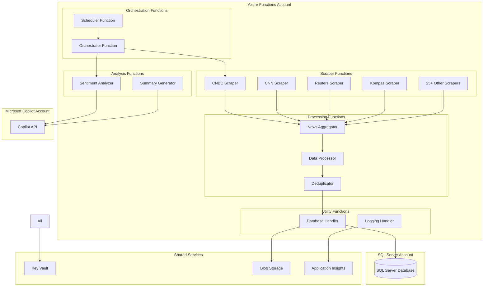
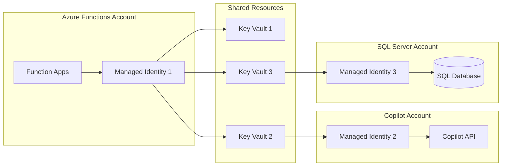

# Design Document: Azure Functions News Scraping System

## Overview

This design document outlines the architecture for porting a comprehensive Python news scraping and sentiment analysis system to Azure Functions. The system will be built from scratch in a separate `azure_functions` folder, maintaining 100% functional parity with the existing system while upgrading to modern cloud-native technologies.

### Key Design Principles

- **Zero Impact Migration**: All new code in separate folder, existing system untouched
- **Cloud-Native Architecture**: Leverage Azure Functions serverless capabilities
- **Security Isolation**: Separate Azure accounts for Copilot, Functions, and SQL Server
- **Technology Modernization**: Replace Google Gemini with Microsoft Copilot, Excel with SQL Server
- **Scalability**: Design for horizontal scaling and high availability
- **Maintainability**: Clean separation of concerns and modular design

### Technology Stack

- **Compute**: Azure Functions (Python 3.9+)
- **Database**: Microsoft SQL Server (Azure SQL Database)
- **AI/ML**: Microsoft Copilot API
- **Storage**: Azure Blob Storage (temporary files)
- **Security**: Azure Key Vault, Managed Identities
- **Monitoring**: Application Insights, Azure Monitor
- **Deployment**: Infrastructure as Code (Bicep/ARM templates)

## Architecture

### High-Level Architecture

The system follows a microservices architecture using Azure Functions, with clear separation between data collection, processing, and analysis components.



### Function App Organization

The system will be organized into multiple Function Apps for better resource management and scaling:

1. **Scraper Function App**: Contains all news scraping functions
2. **Processing Function App**: Data aggregation, processing, and deduplication
3. **Analysis Function App**: Sentiment analysis and summary generation
4. **Orchestration Function App**: Scheduling and workflow orchestration
5. **Utility Function App**: Database operations and shared utilities

### Security Architecture



## Components and Interfaces

### Core Components

#### 1. News Scraper Functions

**Purpose**: Individual HTTP-triggered functions for each news source

**Interface**:
```python
class NewsScraperFunction:
    def __init__(self, source_name: str, base_url: str)
    
    async def scrape_news(
        self, 
        keywords: List[str], 
        start_date: datetime, 
        end_date: datetime
    ) -> List[NewsArticle]
    
    async def validate_article(self, article: NewsArticle) -> bool
    
    async def handle_rate_limiting(self) -> None
```

**Key Features**:
- HTTP trigger with keyword and date parameters
- Source-specific scraping logic
- Rate limiting and retry mechanisms
- Standardized output format
- Error handling and logging

#### 2. Database Handler Component

**Purpose**: Centralized database operations for SQL Server

**Interface**:
```python
class DatabaseHandler:
    def __init__(self, connection_string: str)
    
    async def save_articles(self, articles: List[NewsArticle]) -> None
    
    async def get_articles(
        self, 
        filters: ArticleFilters
    ) -> List[NewsArticle]
    
    async def save_sentiment_analysis(
        self, 
        analysis: SentimentAnalysis
    ) -> None
    
    async def deduplicate_articles(self) -> int
    
    async def execute_query(self, query: str, params: dict) -> Any
```

**Key Features**:
- Connection pooling and retry logic
- Parameterized queries for security
- Transaction management
- Bulk operations for performance
- Comprehensive error handling

#### 3. Copilot Integration Component

**Purpose**: Microsoft Copilot API integration for sentiment analysis

**Interface**:
```python
class CopilotIntegration:
    def __init__(self, api_key: str, endpoint: str)
    
    async def analyze_sentiment(
        self, 
        articles: List[NewsArticle]
    ) -> SentimentAnalysis
    
    async def generate_summary(
        self, 
        articles: List[NewsArticle], 
        role_prompt: str
    ) -> str
    
    async def batch_process(
        self, 
        requests: List[CopilotRequest]
    ) -> List[CopilotResponse]
```

**Key Features**:
- Rate limiting and quota management
- Batch processing capabilities
- Role-specific prompt templates
- Response validation and error handling
- Automatic retry with exponential backoff

#### 4. Scheduler and Orchestrator Functions

**Purpose**: Timer-triggered functions for automated execution

**Interface**:
```python
class SchedulerFunction:
    async def daily_morning_routine(self, timer: TimerRequest) -> None
    
    async def daily_afternoon_routine(self, timer: TimerRequest) -> None
    
    async def weekly_summary_routine(self, timer: TimerRequest) -> None
    
    async def monthly_aggregation_routine(self, timer: TimerRequest) -> None

class OrchestratorFunction:
    async def orchestrate_scraping(
        self, 
        sources: List[str], 
        keywords: List[str]
    ) -> OrchestrationResult
    
    async def orchestrate_analysis(
        self, 
        date_range: DateRange
    ) -> AnalysisResult
```

**Key Features**:
- CRON-based scheduling
- Parallel execution management
- Error handling and retry logic
- Progress tracking and reporting
- Dependency management between tasks

### Data Models

#### NewsArticle Model
```python
@dataclass
class NewsArticle:
    id: Optional[str]
    title: str
    content: str
    url: str
    source: str
    published_date: datetime
    scraped_date: datetime
    keywords: List[str]
    language: str
    author: Optional[str]
    category: Optional[str]
```

#### SentimentAnalysis Model
```python
@dataclass
class SentimentAnalysis:
    id: Optional[str]
    article_ids: List[str]
    sentiment_score: float
    sentiment_label: str  # positive, negative, neutral
    confidence: float
    summary: str
    analysis_date: datetime
    model_version: str
    role_context: str
```

#### Configuration Models
```python
@dataclass
class ScrapingConfig:
    source_name: str
    base_url: str
    selectors: Dict[str, str]
    rate_limit_delay: int
    max_retries: int
    timeout: int

@dataclass
class CopilotConfig:
    api_endpoint: str
    model_name: str
    max_tokens: int
    temperature: float
    role_prompts: Dict[str, str]
```

## Data Models

### SQL Server Database Schema

The database will use a normalized schema optimized for news data storage and retrieval.

#### Core Tables

**news_articles**
```sql
CREATE TABLE news_articles (
    id UNIQUEIDENTIFIER PRIMARY KEY DEFAULT NEWID(),
    title NVARCHAR(500) NOT NULL,
    content NTEXT NOT NULL,
    url NVARCHAR(1000) NOT NULL UNIQUE,
    source_id INT NOT NULL,
    published_date DATETIME2 NOT NULL,
    scraped_date DATETIME2 NOT NULL DEFAULT GETUTCDATE(),
    language VARCHAR(10) DEFAULT 'en',
    author NVARCHAR(200),
    category NVARCHAR(100),
    created_at DATETIME2 DEFAULT GETUTCDATE(),
    updated_at DATETIME2 DEFAULT GETUTCDATE(),
    
    FOREIGN KEY (source_id) REFERENCES news_sources(id),
    INDEX IX_news_articles_published_date (published_date),
    INDEX IX_news_articles_source_date (source_id, published_date),
    INDEX IX_news_articles_url (url)
);
```

**news_sources**
```sql
CREATE TABLE news_sources (
    id INT IDENTITY(1,1) PRIMARY KEY,
    name NVARCHAR(100) NOT NULL UNIQUE,
    base_url NVARCHAR(500) NOT NULL,
    country VARCHAR(10),
    language VARCHAR(10),
    category NVARCHAR(50),
    is_active BIT DEFAULT 1,
    created_at DATETIME2 DEFAULT GETUTCDATE()
);
```

**article_keywords**
```sql
CREATE TABLE article_keywords (
    article_id UNIQUEIDENTIFIER NOT NULL,
    keyword_id INT NOT NULL,
    relevance_score FLOAT DEFAULT 1.0,
    
    PRIMARY KEY (article_id, keyword_id),
    FOREIGN KEY (article_id) REFERENCES news_articles(id) ON DELETE CASCADE,
    FOREIGN KEY (keyword_id) REFERENCES keywords(id)
);
```

**keywords**
```sql
CREATE TABLE keywords (
    id INT IDENTITY(1,1) PRIMARY KEY,
    keyword NVARCHAR(100) NOT NULL UNIQUE,
    category NVARCHAR(50),
    is_active BIT DEFAULT 1,
    created_at DATETIME2 DEFAULT GETUTCDATE()
);
```

**sentiment_analyses**
```sql
CREATE TABLE sentiment_analyses (
    id UNIQUEIDENTIFIER PRIMARY KEY DEFAULT NEWID(),
    analysis_date DATETIME2 NOT NULL,
    date_range_start DATETIME2 NOT NULL,
    date_range_end DATETIME2 NOT NULL,
    sentiment_score FLOAT NOT NULL,
    sentiment_label VARCHAR(20) NOT NULL,
    confidence FLOAT NOT NULL,
    summary NTEXT NOT NULL,
    model_version VARCHAR(50) NOT NULL,
    role_context NVARCHAR(200),
    article_count INT NOT NULL,
    created_at DATETIME2 DEFAULT GETUTCDATE(),
    
    INDEX IX_sentiment_analyses_date (analysis_date),
    INDEX IX_sentiment_analyses_range (date_range_start, date_range_end)
);
```

**sentiment_analysis_articles**
```sql
CREATE TABLE sentiment_analysis_articles (
    sentiment_analysis_id UNIQUEIDENTIFIER NOT NULL,
    article_id UNIQUEIDENTIFIER NOT NULL,
    
    PRIMARY KEY (sentiment_analysis_id, article_id),
    FOREIGN KEY (sentiment_analysis_id) REFERENCES sentiment_analyses(id) ON DELETE CASCADE,
    FOREIGN KEY (article_id) REFERENCES news_articles(id)
);
```

#### Utility Tables

**execution_logs**
```sql
CREATE TABLE execution_logs (
    id UNIQUEIDENTIFIER PRIMARY KEY DEFAULT NEWID(),
    function_name NVARCHAR(100) NOT NULL,
    execution_id NVARCHAR(100) NOT NULL,
    start_time DATETIME2 NOT NULL,
    end_time DATETIME2,
    status VARCHAR(20) NOT NULL, -- success, failed, running
    error_message NTEXT,
    input_parameters NTEXT,
    output_summary NTEXT,
    duration_ms INT,
    
    INDEX IX_execution_logs_function_time (function_name, start_time),
    INDEX IX_execution_logs_status (status, start_time)
);
```

**configuration**
```sql
CREATE TABLE configuration (
    id INT IDENTITY(1,1) PRIMARY KEY,
    config_key NVARCHAR(100) NOT NULL UNIQUE,
    config_value NTEXT NOT NULL,
    config_type VARCHAR(20) NOT NULL, -- string, json, int, bool
    description NVARCHAR(500),
    is_sensitive BIT DEFAULT 0,
    created_at DATETIME2 DEFAULT GETUTCDATE(),
    updated_at DATETIME2 DEFAULT GETUTCDATE()
);
```

### Data Migration Strategy

The system will include migration functions to transfer existing Excel data to SQL Server:

1. **Excel Reader Function**: Parse existing Excel files and extract data
2. **Data Mapper Function**: Map Excel columns to database schema
3. **Bulk Insert Function**: Efficiently insert historical data
4. **Validation Function**: Verify data integrity after migration
5. **Rollback Function**: Ability to revert migration if needed

## Error Handling

### Error Handling Strategy

The system implements a comprehensive error handling approach with multiple layers:

#### 1. Function-Level Error Handling

Each Azure Function implements standardized error handling:

```python
async def scraper_function_wrapper(req: func.HttpRequest) -> func.HttpResponse:
    try:
        # Function logic
        result = await execute_scraping_logic(req)
        return func.HttpResponse(
            json.dumps({"status": "success", "data": result}),
            status_code=200,
            mimetype="application/json"
        )
    except ValidationError as e:
        logger.error(f"Validation error: {str(e)}")
        return func.HttpResponse(
            json.dumps({"status": "error", "error": "Invalid input parameters"}),
            status_code=400,
            mimetype="application/json"
        )
    except RateLimitError as e:
        logger.warning(f"Rate limit exceeded: {str(e)}")
        return func.HttpResponse(
            json.dumps({"status": "retry", "error": "Rate limit exceeded"}),
            status_code=429,
            mimetype="application/json"
        )
    except DatabaseError as e:
        logger.error(f"Database error: {str(e)}")
        return func.HttpResponse(
            json.dumps({"status": "error", "error": "Database operation failed"}),
            status_code=500,
            mimetype="application/json"
        )
    except Exception as e:
        logger.error(f"Unexpected error: {str(e)}", exc_info=True)
        return func.HttpResponse(
            json.dumps({"status": "error", "error": "Internal server error"}),
            status_code=500,
            mimetype="application/json"
        )
```

#### 2. Retry Mechanisms

**Exponential Backoff Strategy**:
- Initial delay: 1 second
- Maximum delay: 60 seconds
- Maximum retries: 3 attempts
- Jitter to prevent thundering herd

**Retry Scenarios**:
- Network timeouts
- Rate limiting responses
- Temporary database unavailability
- Copilot API throttling

#### 3. Circuit Breaker Pattern

Implement circuit breakers for external dependencies:
- **Closed State**: Normal operation
- **Open State**: Fail fast when error threshold exceeded
- **Half-Open State**: Test recovery after timeout period

#### 4. Dead Letter Queue

For failed messages that exceed retry limits:
- Store failed requests in Azure Service Bus Dead Letter Queue
- Manual review and reprocessing capability
- Alerting for dead letter queue accumulation

### Monitoring and Alerting

#### Application Insights Integration

**Custom Metrics**:
- Function execution duration
- Success/failure rates per function
- Database query performance
- Copilot API response times
- Article processing throughput

**Custom Events**:
- Scraping job completion
- Sentiment analysis completion
- Database migration events
- Configuration changes

**Alert Rules**:
- Function failure rate > 5%
- Database connection failures
- Copilot API quota exhaustion
- Unusual processing delays

#### Logging Strategy

**Structured Logging**:
```python
logger.info("Scraping completed", extra={
    "source": source_name,
    "articles_found": len(articles),
    "execution_time_ms": execution_time,
    "keywords": keywords,
    "date_range": f"{start_date} to {end_date}"
})
```

**Log Levels**:
- **DEBUG**: Detailed execution flow
- **INFO**: Normal operations and milestones
- **WARNING**: Recoverable errors and rate limiting
- **ERROR**: Function failures and data issues
- **CRITICAL**: System-wide failures

## Testing Strategy

### Dual Testing Approach

The testing strategy combines unit tests for specific scenarios with property-based tests for comprehensive validation.

#### Unit Testing Strategy

**Test Categories**:
1. **Function Integration Tests**: Test individual Azure Functions end-to-end
2. **Database Operation Tests**: Verify SQL Server operations and schema
3. **API Integration Tests**: Test Copilot API integration and error handling
4. **Data Processing Tests**: Validate data transformation and deduplication
5. **Configuration Tests**: Verify environment and Key Vault integration

**Test Structure**:
```python
class TestNewsScraperFunction:
    def test_scrape_valid_articles(self):
        # Test successful scraping with valid parameters
        
    def test_scrape_invalid_date_range(self):
        # Test error handling for invalid date ranges
        
    def test_scrape_rate_limiting(self):
        # Test rate limiting behavior
        
    def test_scrape_network_timeout(self):
        # Test network timeout handling
```

**Mock Strategy**:
- Mock external APIs (Copilot, news websites)
- Mock database connections for unit tests
- Use test containers for integration tests
- Mock Azure services (Key Vault, Blob Storage)

#### Property-Based Testing Strategy

Property-based tests will validate universal properties across all inputs using the Hypothesis library.

**Test Configuration**:
- Minimum 100 iterations per property test
- Custom generators for news articles, dates, and keywords
- Shrinking enabled for minimal failing examples
- Seed-based reproducibility for CI/CD

**Property Test Examples**:
```python
from hypothesis import given, strategies as st

@given(st.lists(st.text(min_size=1), min_size=1))
def test_deduplication_preserves_unique_articles(articles):
    # Property: Deduplication should preserve all unique articles
    
@given(st.datetimes(), st.datetimes())
def test_date_range_validation(start_date, end_date):
    # Property: Date range validation should be consistent
```

### Test Environment Setup

**Local Development**:
- Azure Functions Core Tools
- SQL Server LocalDB or Docker container
- Mock Copilot API responses
- Test data fixtures

**CI/CD Pipeline**:
- Automated unit and integration tests
- Property-based test execution
- Code coverage reporting (minimum 80%)
- Security scanning and dependency checks

**Staging Environment**:
- Full Azure environment replica
- Sanitized production data subset
- End-to-end workflow testing
- Performance and load testing

Now I need to use the prework tool to analyze the acceptance criteria before writing the Correctness Properties section.

<function_calls>
<invoke name="prework">
<parameter name="featureName">azure-functions-porting

## Correctness Properties

*A property is a characteristic or behavior that should hold true across all valid executions of a system—essentially, a formal statement about what the system should do. Properties serve as the bridge between human-readable specifications and machine-verifiable correctness guarantees.*

Based on the prework analysis and property reflection, the following properties validate the core correctness requirements of the Azure Functions porting system:

### Property 1: Output Format Consistency
*For any* scraper function and any valid input parameters, the output format should match exactly the schema produced by the original system (same fields, data types, and structure)
**Validates: Requirements 1.2**

### Property 2: Database-Only Storage
*For any* data storage operation, all data should be written to SQL Server database tables and no Excel files should be created or modified
**Validates: Requirements 1.3, 4.1, 4.2, 5.4**

### Property 3: Copilot API Integration
*For any* sentiment analysis operation, Microsoft Copilot API should be called and no Google Gemini API calls should be made
**Validates: Requirements 1.4, 5.1**

### Property 4: Schedule Timing Consistency
*For any* timer-triggered function, the execution schedule should match the timing patterns defined in the original system
**Validates: Requirements 1.5, 6.1, 6.2, 6.3**

### Property 5: Function Trigger Types
*For any* deployed Azure Function, the trigger type (HTTP, Timer) should match the intended use case (scrapers use HTTP, schedulers use Timer)
**Validates: Requirements 2.2**

### Property 6: Secure Configuration
*For any* sensitive configuration value, it should be stored in Azure Key Vault and not hardcoded in function code
**Validates: Requirements 2.4, 7.4**

### Property 7: Parameter Handling
*For any* scraper function execution, the function should accept and correctly process keyword and date filter parameters
**Validates: Requirements 3.2**

### Property 8: Standardized Article Format
*For any* scraped article, the output should contain all required fields (title, date, url, content, source, keywords) with valid data types
**Validates: Requirements 3.3**

### Property 9: Error Handling and Logging
*For any* function execution that encounters an error, the error should be caught, logged with sufficient detail, and handled gracefully
**Validates: Requirements 3.4, 8.1, 8.2, 8.5**

### Property 10: Rate Limiting Behavior
*For any* scraper function that encounters rate limiting, appropriate delays and retry mechanisms should be implemented
**Validates: Requirements 3.5**

### Property 11: Database Schema Compliance
*For any* data insertion operation, the data should be stored in the correct SQL Server table with proper schema validation
**Validates: Requirements 4.1, 4.4**

### Property 12: Data Integrity Maintenance
*For any* database write operation, referential integrity constraints should be maintained and foreign key relationships preserved
**Validates: Requirements 4.3, 12.2**

### Property 13: Database Retry Logic
*For any* database connection failure, the system should implement retry logic with exponential backoff before failing
**Validates: Requirements 4.5**

### Property 14: Date Range Aggregation
*For any* sentiment analysis request with date range parameters, the system should retrieve and process only articles within that date range
**Validates: Requirements 5.2**

### Property 15: Role-Specific Prompts
*For any* summary generation request, the system should apply the appropriate role-specific prompt template to the Copilot API
**Validates: Requirements 5.3**

### Property 16: Batch Processing
*For any* large content volume processing, the system should split the work into appropriately sized batches for API calls
**Validates: Requirements 5.5**

### Property 17: Orchestration Order
*For any* multi-function workflow, functions should execute in the correct dependency order and handle failures appropriately
**Validates: Requirements 6.4**

### Property 18: Failure Recovery
*For any* scheduling failure, the system should implement retry logic and send appropriate alerts
**Validates: Requirements 6.5**

### Property 19: Account Separation
*For any* external service access (Copilot, SQL Server), the system should use the dedicated account credentials for that service
**Validates: Requirements 7.1, 7.2, 7.3**

### Property 20: Managed Identity Usage
*For any* cross-service authentication, the system should use managed identities or service principals instead of hardcoded credentials
**Validates: Requirements 7.5**

### Property 21: Performance Metrics Tracking
*For any* function execution, key performance metrics (duration, success rate, resource usage) should be tracked and reported
**Validates: Requirements 8.3**

### Property 22: Alert Integration
*For any* alerting condition, the system should integrate with Azure Monitor and send notifications appropriately
**Validates: Requirements 8.4**

### Property 23: Blob Storage Usage
*For any* large dataset processing operation, temporary files should be stored in Azure Blob Storage rather than local storage
**Validates: Requirements 9.1**

### Property 24: Memory Efficiency
*For any* Excel file processing operation, memory usage should remain within acceptable limits through streaming operations
**Validates: Requirements 9.2**

### Property 25: URL-Based Deduplication
*For any* set of scraped articles, duplicate articles should be identified and handled based on URL uniqueness
**Validates: Requirements 9.3**

### Property 26: Data Format Standardization
*For any* data transformation operation, consistent column mapping and data cleaning rules should be applied
**Validates: Requirements 9.4**

### Property 27: Caching Strategy
*For any* frequently accessed data, appropriate caching mechanisms should be implemented to improve performance
**Validates: Requirements 9.5**

### Property 28: Code Isolation
*For any* new Azure Functions code, it should be placed in the azure_functions folder and no existing files should be modified
**Validates: Requirements 11.1, 11.2, 11.4, 11.5**

### Property 29: System Independence
*For any* testing or deployment operation, the new Azure Functions system should not interfere with existing system operations
**Validates: Requirements 11.3**

### Property 30: Query Performance
*For any* database query operation, proper indexes should be used and queries should complete within acceptable time limits
**Validates: Requirements 12.3**

### Property 31: Data Migration Integrity
*For any* data migrated from Excel to SQL Server, all existing data relationships and formats should be preserved
**Validates: Requirements 12.4**

### Property 32: Backup and Recovery
*For any* backup operation, automated backup procedures should execute successfully and recovery should be possible
**Validates: Requirements 12.5**

### Property 33: Infrastructure as Code
*For any* deployment operation, Infrastructure as Code templates should be used for consistent and repeatable deployments
**Validates: Requirements 10.1**

### Property 34: Zero Downtime Deployment
*For any* code update deployment, blue-green or slot-based deployment strategies should be used to achieve zero downtime
**Validates: Requirements 10.2**

### Property 35: Dependency Management
*For any* function deployment, requirements.txt should be used and Python packages should be managed properly
**Validates: Requirements 10.3**

### Property 36: Version Control and Rollback
*For any* function version, version information should be tracked and rollback capabilities should be available
**Validates: Requirements 10.4**

### Property 37: Deployment Testing
*For any* deployment process, automated testing and validation steps should be included and executed
**Validates: Requirements 10.5**
## Testing Strategy

### Dual Testing Approach

The testing strategy combines unit tests for specific scenarios with property-based tests for comprehensive validation. Both approaches are complementary and necessary for ensuring system correctness.

#### Unit Testing Strategy

Unit tests will focus on specific examples, edge cases, and error conditions:

**Test Categories**:
- **Function Integration Tests**: Test individual Azure Functions with realistic inputs
- **Database Operation Tests**: Verify SQL Server schema, queries, and data integrity
- **API Integration Tests**: Test Copilot API integration with various response scenarios
- **Error Handling Tests**: Validate error scenarios and recovery mechanisms
- **Configuration Tests**: Verify Key Vault integration and environment setup

**Example Unit Tests**:
```python
def test_cnbc_scraper_valid_articles():
    # Test CNBC scraper with known good parameters
    
def test_database_connection_retry():
    # Test database retry logic with simulated failures
    
def test_copilot_api_rate_limiting():
    # Test Copilot API rate limiting response handling
    
def test_scheduler_function_error_recovery():
    # Test scheduler error handling and retry mechanisms
```

**Mock Strategy**:
- Mock external APIs (Copilot, news websites) for predictable testing
- Use test containers for SQL Server integration tests
- Mock Azure services (Key Vault, Blob Storage) for unit tests
- Create test fixtures for common data scenarios

#### Property-Based Testing Strategy

Property-based tests will validate universal properties across all inputs using the Hypothesis library for Python.

**Configuration**:
- Minimum 100 iterations per property test
- Custom generators for news articles, dates, keywords, and API responses
- Shrinking enabled to find minimal failing examples
- Reproducible tests with seed-based generation

**Property Test Implementation**:
Each correctness property will be implemented as a property-based test with the following tag format:
**Feature: azure-functions-porting, Property {number}: {property_text}**

**Example Property Tests**:
```python
from hypothesis import given, strategies as st

@given(st.lists(news_article_strategy(), min_size=1))
def test_output_format_consistency(articles):
    """Feature: azure-functions-porting, Property 1: Output Format Consistency"""
    # Test that scraper output matches original system format
    
@given(st.text(min_size=1), st.datetimes(), st.datetimes())
def test_database_only_storage(keyword, start_date, end_date):
    """Feature: azure-functions-porting, Property 2: Database-Only Storage"""
    # Test that all data goes to SQL Server, no Excel files created
    
@given(st.lists(st.text(min_size=1), min_size=1))
def test_url_based_deduplication(urls):
    """Feature: azure-functions-porting, Property 25: URL-Based Deduplication"""
    # Test that duplicate URLs are properly identified and handled
```

**Custom Generators**:
```python
@st.composite
def news_article_strategy(draw):
    return NewsArticle(
        title=draw(st.text(min_size=1, max_size=200)),
        content=draw(st.text(min_size=10, max_size=5000)),
        url=draw(st.text(min_size=10).map(lambda x: f"https://example.com/{x}")),
        source=draw(st.sampled_from(['CNBC', 'CNN', 'Reuters', 'Kompas'])),
        published_date=draw(st.datetimes()),
        keywords=draw(st.lists(st.text(min_size=1), min_size=1, max_size=5))
    )
```

### Test Environment Setup

**Local Development Environment**:
- Azure Functions Core Tools for local function execution
- SQL Server LocalDB or Docker container for database testing
- Mock servers for external API testing
- Test data fixtures and generators

**CI/CD Pipeline Testing**:
- Automated unit test execution on every commit
- Property-based test execution with extended iteration counts
- Code coverage reporting (minimum 80% coverage required)
- Security scanning and dependency vulnerability checks
- Integration tests against staging environment

**Staging Environment**:
- Full Azure environment replica with all services
- Sanitized subset of production data for realistic testing
- End-to-end workflow testing across all functions
- Performance and load testing with realistic data volumes
- Disaster recovery and backup testing

### Test Data Management

**Test Data Strategy**:
- Synthetic data generation for property-based tests
- Anonymized production data subset for integration tests
- Version-controlled test fixtures for unit tests
- Automated test data cleanup and refresh procedures

**Performance Testing**:
- Load testing with realistic article volumes (1000+ articles per day)
- Stress testing of Copilot API integration with rate limiting
- Database performance testing with large datasets
- Memory usage testing for Excel file processing operations

This comprehensive testing strategy ensures that the Azure Functions porting maintains 100% functional parity with the existing system while providing confidence in the new cloud-native architecture.