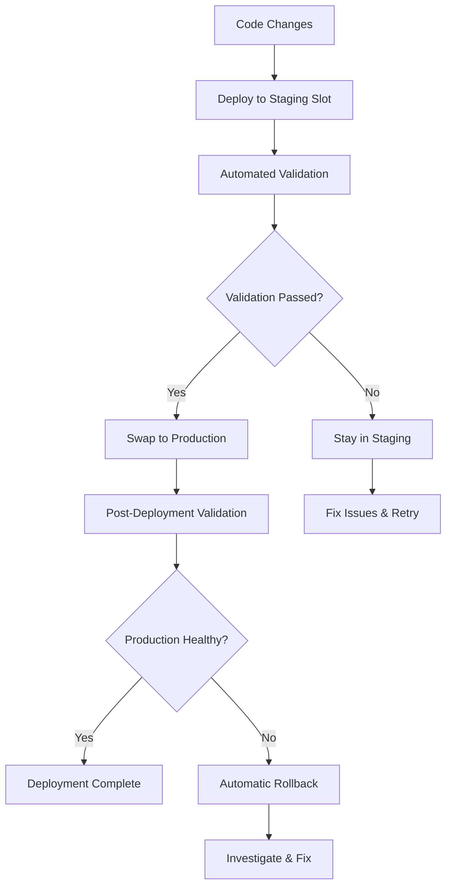

# Azure Functions Deployment Slots and Blue-Green Deployment Guide

This guide explains how to use deployment slots and blue-green deployment strategy for zero-downtime deployments of the Azure Functions News Scraping System.

## Overview

The system implements a comprehensive deployment strategy using Azure Functions deployment slots to achieve:

- **Zero-downtime deployments**
- **Automated validation and testing**
- **Quick rollback capabilities**
- **Blue-green deployment pattern**
- **Comprehensive monitoring and alerting**

## Architecture

### Deployment Slots

The system uses three deployment slots:

1. **Production Slot** - Live production environment serving user traffic
2. **Staging Slot** - Pre-production environment for validation and testing
3. **Blue-Green Slot** - Additional slot for advanced deployment scenarios

### Deployment Flow



## Scripts and Tools

### Core Deployment Scripts

| Script | Purpose | Usage |
|--------|---------|-------|
| `deploy-with-slots.ps1` | Main deployment orchestrator | Complete deployment process |
| `blue-green-deploy.ps1` | Blue-green slot swapping | Zero-downtime promotion |
| `deployment-validation.ps1` | Comprehensive validation | Test deployment health |
| `rollback-deployment.ps1` | Automated rollback | Quick recovery from issues |

### Infrastructure Scripts

| Script | Purpose | Usage |
|--------|---------|-------|
| `deploy-infrastructure.ps1` | Deploy Azure resources | Initial setup |
| `main.bicep` | Infrastructure as Code | Resource definitions |
| `functionapp-with-slots.bicep` | Function App with slots | Slot configuration |

## Usage Guide

### 1. Initial Setup

Deploy the infrastructure with deployment slots enabled:

```powershell
# Deploy infrastructure with slots
.\scripts\deploy-infrastructure.ps1 -ResourceGroupName "newscraper-rg" -SqlAdminPassword "YourPassword123!"
```

### 2. Standard Deployment

Deploy code using the comprehensive deployment script:

```powershell
# Full deployment with validation
.\scripts\deploy-with-slots.ps1 -FunctionAppName "newscraper-func-dev"

# Skip validation (not recommended for production)
.\scripts\deploy-with-slots.ps1 -FunctionAppName "newscraper-func-dev" -SkipValidation

# Auto-promote without manual confirmation
.\scripts\deploy-with-slots.ps1 -FunctionAppName "newscraper-func-dev" -AutoPromote
```

### 3. Manual Blue-Green Deployment

Perform manual slot swapping:

```powershell
# Deploy to staging first
func azure functionapp publish newscraper-func-dev --slot staging

# Validate staging deployment
.\scripts\deployment-validation.ps1 -FunctionAppName "newscraper-func-dev" -SlotName "staging"

# Swap to production
.\scripts\blue-green-deploy.ps1 -FunctionAppName "newscraper-func-dev" -SourceSlot "staging"
```

### 4. Rollback Deployment

Quick rollback in case of issues:

```powershell
# Automatic rollback with confirmation
.\scripts\rollback-deployment.ps1 -FunctionAppName "newscraper-func-dev"

# Force rollback without confirmation
.\scripts\rollback-deployment.ps1 -FunctionAppName "newscraper-func-dev" -Force

# Rollback from specific slot
.\scripts\rollback-deployment.ps1 -FunctionAppName "newscraper-func-dev" -TargetSlot "blue-green"
```

### 5. Validation Only

Run validation without deployment:

```powershell
# Validate production
.\scripts\deployment-validation.ps1 -FunctionAppName "newscraper-func-dev"

# Validate specific slot with detailed output
.\scripts\deployment-validation.ps1 -FunctionAppName "newscraper-func-dev" -SlotName "staging" -Detailed
```

## Configuration

### Deployment Configuration

The `deployment-config.json` file contains comprehensive configuration options:

```json
{
  "deployment": {
    "slots": {
      "staging": {
        "enabled": true,
        "autoSwap": false,
        "warmupPingPath": "/api/test_function"
      }
    },
    "validation": {
      "enabled": true,
      "timeoutSeconds": 300,
      "healthCheckEndpoints": [
        {
          "path": "/api/test_function",
          "method": "GET",
          "expectedStatus": 200
        }
      ]
    },
    "rollback": {
      "enabled": true,
      "triggerOnValidationFailure": true
    }
  }
}
```

### Environment-Specific Settings

Different environments can have different deployment behaviors:

- **Development**: Skip validation, disable rollback
- **Staging**: Enable validation with reduced timeout
- **Production**: Full validation and rollback protection

## Validation Process

### Automated Validation Tests

The deployment validation includes:

1. **Basic Connectivity Test**
   - HTTP endpoint accessibility
   - Response time measurement

2. **Configuration Validation**
   - Required app settings verification
   - Environment variable checks

3. **Database Connectivity Test**
   - SQL Server connection validation
   - Schema verification

4. **Function Endpoints Test**
   - Individual function testing
   - Success rate calculation

5. **Performance Test**
   - Response time benchmarking
   - Load testing (optional)

### Custom Validation

Add custom validation endpoints in `deployment-config.json`:

```json
{
  "validation": {
    "healthCheckEndpoints": [
      {
        "path": "/api/test_function",
        "method": "GET",
        "expectedStatus": 200
      },
      {
        "path": "/api/health/database",
        "method": "GET",
        "expectedStatus": 200
      },
      {
        "path": "/api/health/external-services",
        "method": "GET",
        "expectedStatus": 200
      }
    ]
  }
}
```

## Monitoring and Alerting

### Application Insights Integration

The deployment process integrates with Application Insights to track:

- Deployment duration and success rate
- Validation response times
- Rollback events
- Custom deployment metrics

### Alert Configuration

Configure alerts for deployment events:

```json
{
  "monitoring": {
    "alerts": {
      "enabled": true,
      "channels": ["email", "teams"],
      "events": [
        "deployment.failed",
        "validation.failed",
        "rollback.triggered",
        "performance.degraded"
      ]
    }
  }
}
```

## Best Practices

### 1. Pre-Deployment Checklist

- [ ] Code changes tested locally
- [ ] Unit tests passing
- [ ] Integration tests passing
- [ ] Database migrations prepared
- [ ] Configuration changes documented

### 2. Deployment Process

- [ ] Deploy to staging slot first
- [ ] Run comprehensive validation
- [ ] Test critical user journeys
- [ ] Monitor performance metrics
- [ ] Promote to production only after validation

### 3. Post-Deployment

- [ ] Monitor Application Insights for errors
- [ ] Verify all function endpoints
- [ ] Check database connectivity
- [ ] Monitor performance metrics
- [ ] Be prepared to rollback if issues arise

### 4. Rollback Criteria

Trigger rollback if:
- Validation failure rate > 20%
- Average response time > 2 seconds
- Database connectivity issues
- Critical function failures
- User-reported issues

## Troubleshooting

### Common Issues

1. **Slot Swap Fails**
   ```powershell
   # Check slot status
   az functionapp deployment slot list --name "newscraper-func-dev" --resource-group "newscraper-rg"
   
   # Restart slots if needed
   az functionapp restart --name "newscraper-func-dev" --slot "staging"
   ```

2. **Validation Timeout**
   ```powershell
   # Increase timeout
   .\scripts\deployment-validation.ps1 -FunctionAppName "newscraper-func-dev" -TimeoutSeconds 600
   ```

3. **Rollback Issues**
   ```powershell
   # Manual slot swap
   az functionapp deployment slot swap --name "newscraper-func-dev" --resource-group "newscraper-rg" --slot "staging" --target-slot "production"
   ```

### Debugging Commands

```powershell
# View function logs
func azure functionapp logstream newscraper-func-dev

# View slot-specific logs
func azure functionapp logstream newscraper-func-dev --slot staging

# Check app settings
az functionapp config appsettings list --name "newscraper-func-dev" --slot "staging"

# Test endpoint manually
Invoke-RestMethod -Uri "https://newscraper-func-dev-staging.azurewebsites.net/api/test_function"
```

## Security Considerations

### Slot Isolation

- Each slot has its own managed identity
- Separate Key Vault access policies
- Isolated configuration settings
- Independent monitoring and logging

### Credential Management

- Use managed identities for Azure service authentication
- Store sensitive configuration in Key Vault
- Rotate credentials regularly
- Monitor access logs

## Performance Optimization

### Slot Warmup

Configure slot warmup to reduce cold start times:

```json
{
  "deployment": {
    "slots": {
      "staging": {
        "warmupPingPath": "/api/test_function",
        "warmupRequests": 5
      }
    }
  }
}
```

### Resource Allocation

- Monitor resource usage during deployments
- Scale up during deployment if needed
- Use appropriate App Service Plan tier
- Consider dedicated deployment slots for high-traffic applications

## Conclusion

The deployment slots and blue-green deployment strategy provides a robust, zero-downtime deployment solution for the Azure Functions News Scraping System. By following this guide and using the provided scripts, you can achieve reliable, automated deployments with comprehensive validation and quick rollback capabilities.

For additional support or questions, refer to the Azure Functions documentation or contact the development team.