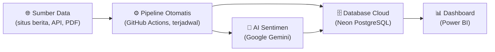
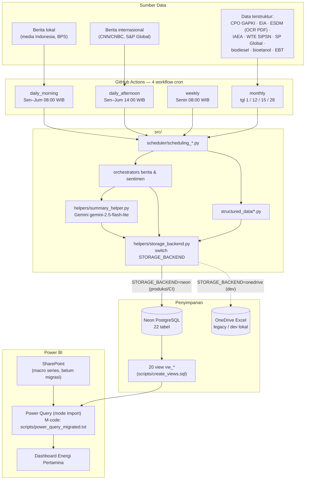

# Diagram Alur Data End-to-End

Diagram Mermaid — render otomatis di GitHub. Versi teknis detail ada di [docs/01-arsitektur.md](../01-arsitektur.md).

## Versi Ringkas (untuk manajemen)

Sistem mengumpulkan data energi secara otomatis dari belasan sumber publik dan berlangganan (berita, harga komoditas, statistik pemerintah), memprosesnya di cloud tanpa server sendiri (GitHub Actions), merangkum sentimen berita dengan AI (Google Gemini), menyimpan hasilnya ke database cloud (Neon PostgreSQL), dan menyajikannya sebagai dashboard Power BI yang di-refresh berkala. Seluruh rantai berjalan otomatis pada jadwal harian/mingguan/bulanan tanpa intervensi manual.

## Versi Teknis

## Titik Rawan (untuk operator)

| Titik di diagram | Risiko | Rujukan |
|---|---|---|
| Sumber → Actions | Situs berubah struktur/pindah domain → scraper gagal | [docs/08](../08-maintenance.md#diagnosis-scraper-rusak-situs-berubah) |
| Cron GitHub | Delay 3–5 jam; auto-disable 60 hari inaktif | [docs/04](../04-pipeline-scheduling.md) |
| Gemini | Kuota free tier / key expired | [03-runbook-hari-pertama.md](03-runbook-hari-pertama.md#skenario-3-api-key-expired--kena-limit) |
| Neon | Limit 512 MB free tier | [docs/08](../08-maintenance.md#bulanan) |
| View → Power Query | Nama kolom case-sensitive; format angka teks (koma ribuan) | [docs/07](../07-power-bi.md) |
| Power BI refresh | Butuh 2 kredensial: Neon + SharePoint | [docs/07](../07-power-bi.md) |
